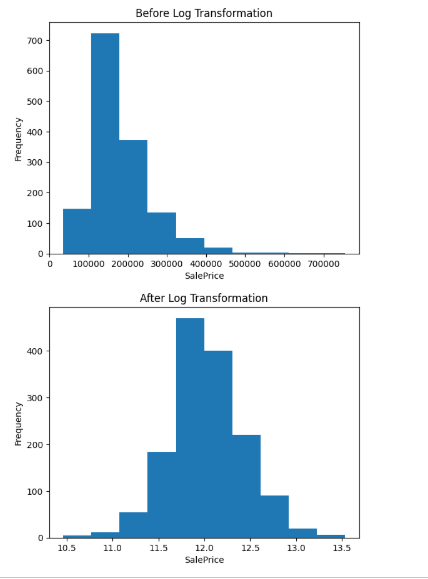
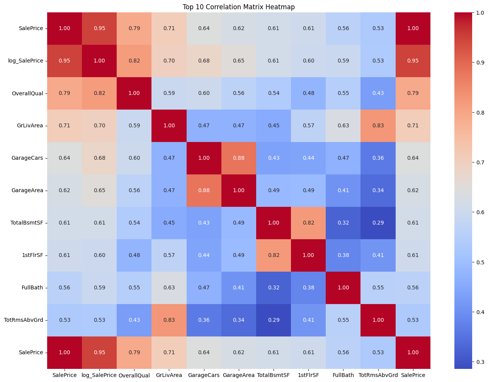
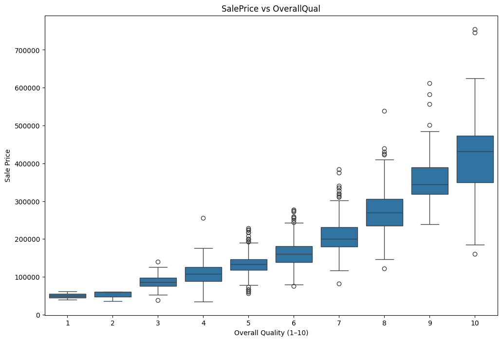
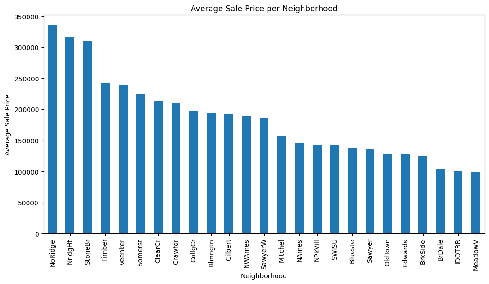

# House Price Analysis Final Insights & Reporting

---

# 📊 Managerial Report

## Executive Summary

This analysis explores the key drivers of house prices using exploratory data analysis (EDA). The objective was to identify the most influential factors affecting SalePrice, assess data anomalies, and present impactful visual insights to support strategic decision-making.

---

# 1️⃣ Top 3 Drivers of House Price

Based on correlation analysis and visualization, the three most important factors influencing house prices are:

### A. Overall Quality (OverallQual)

This variable shows the strongest and most consistent correlation with SalePrice. Houses with higher construction and finish quality command significantly higher prices. The relationship is stable and monotonic across the dataset.

### B. Above-Ground Living Area (GrLivArea)

Living area is the most important size-related feature. Larger usable space is directly associated with higher sale prices. While the relationship is strongly positive, extremely large homes show slight diminishing marginal returns.

### C. Neighborhood (Location)

Location plays a critical role in price formation. Certain neighborhoods consistently exhibit higher average sale prices and function as the premium (“Beverly Hills”) areas of the dataset.

### Managerial Implication

The primary drivers of price are quality, usable living space, and location. Investments in improving finish quality and targeting high-value neighborhoods provide the greatest leverage for increasing property value.

# 2️⃣ Anomaly Report – Missing Data Assessment

During exploratory analysis, several features were identified with substantial missing values:

* PoolQC
* MiscFeature
* Alley
* Fence
* FireplaceQu
* LotFrontage

In many cases, missing values represent the absence of a feature (e.g., no pool or no fence) rather than data entry errors.

### Potential Impact on Future Models

* **Bias Risk:** Improper handling may distort model predictions.
* **Reduced Accuracy:** High missing rates can weaken predictive performance.
* **Noise Introduction:** Extremely sparse features may contribute limited value.

### Recommendation

* Treat absence-related categorical features as "None".
* Apply median imputation for numerical variables.
* Consider removing features with extremely high missing percentages if they provide minimal predictive power.

# 3️⃣ Visual Summary – Most Impactful Charts

To support the analytical findings, four major visualizations were developed. These charts provide both statistical clarity and practical business insight into house price behavior.

---

## 1️⃣ Distribution of SalePrice (Before and After Log Transformation)

The first visualization compares the distribution of SalePrice before and after applying a log transformation.

### Key Observations:

* The original SalePrice distribution is  **right-skewed** , meaning a small number of houses have very high prices.
* This skewness can negatively affect predictive models, especially linear regression, by violating normality assumptions.
* After applying a log transformation (`log1p`), the distribution becomes significantly more  **normally distributed and symmetric** .
* The transformation reduces the impact of extreme outliers and stabilizes variance.

### Managerial Insight:

Log transformation improves model stability and prediction reliability. It ensures that high-priced outliers do not disproportionately influence the model.

## 2️⃣ Top 10 Correlation Matrix Heatmap

The correlation heatmap highlights the relationships among the top 10 features most strongly correlated with SalePrice.

### Key Observations:

* **OverallQual** shows the strongest positive correlation with SalePrice.
* **GrLivArea** and **GarageCars** also demonstrate strong relationships.
* Several features are moderately correlated with each other, indicating possible multicollinearity.
* The heatmap visually confirms which variables should be prioritized in predictive modeling.

### Managerial Insight:

Quality, size, and garage capacity are statistically validated as key price drivers. These variables should be central to valuation strategy and modeling.

## 3️⃣ Boxplot – SalePrice vs OverallQual

This visualization examines how SalePrice changes across different OverallQual ratings (1–10 scale).

### Key Observations:

* There is a clear upward trend in median sale price as quality increases.
* Higher quality levels (8–10) show significantly higher price ranges.
* Variability in price also increases at higher quality levels.
* The relationship appears strong and monotonic.

### Managerial Insight:

Improving construction quality has a direct and substantial impact on property value. This is the single most influential controllable factor.

## 4️⃣ Average Sale Price by Neighborhood (Bar Chart)

This chart compares the mean SalePrice across neighborhoods.

### Key Observations:

* There is significant variation in average prices across neighborhoods.
* Certain areas clearly command premium pricing and function as high-end markets.
* Lower-tier neighborhoods show consistently lower average sale prices.

### Managerial Insight:

Location plays a critical strategic role in price determination. Investment decisions should prioritize high-performing neighborhoods to maximize return.

# 📌 Final Conclusion

The analysis confirms that house prices are primarily driven by construction quality, usable living area, and neighborhood location. Proper handling of missing data is essential to ensure model reliability. The visualizations provide clear evidence supporting these conclusions and guide strategic decision-making for pricing and investment.
